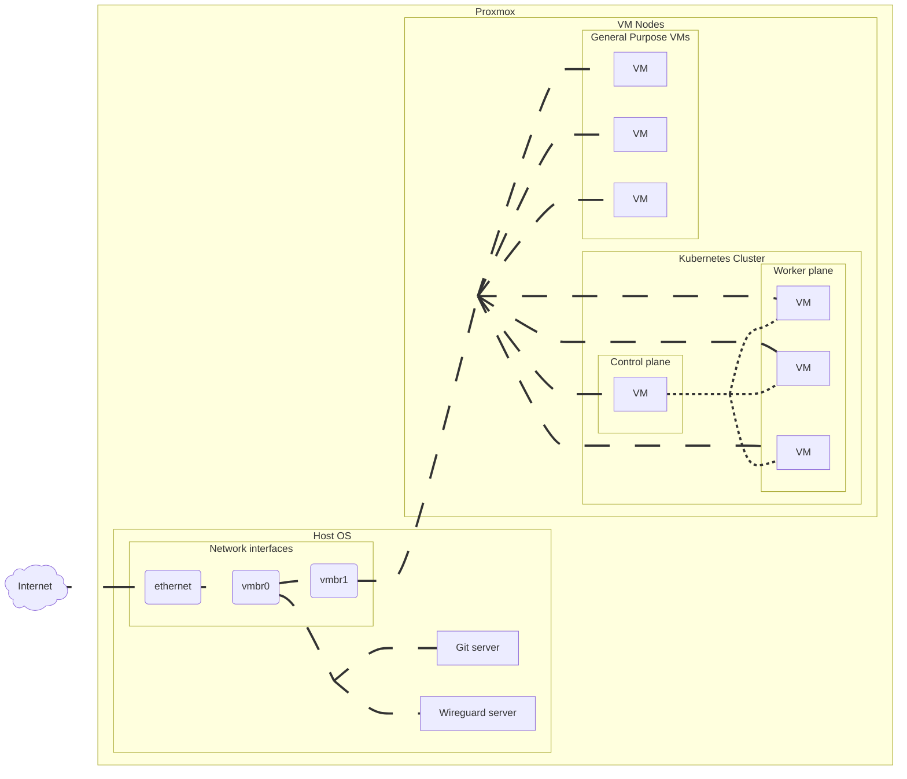

# Ploud
My Proxmox Cloud Infrastructure

# Blueprint

# Prerequisite
* Proxmox

# Decision
## Kubernetes
* Should kubernetes setup phase be in terraform apply phase?
  - Tie it together for now. 

# Milestone
* Someday we have to implement HA on this blueprint.

# Note
* [Proxmox root user should use `bash` as default shell](https://github.com/bpg/terraform-provider-proxmox/issues/1251)